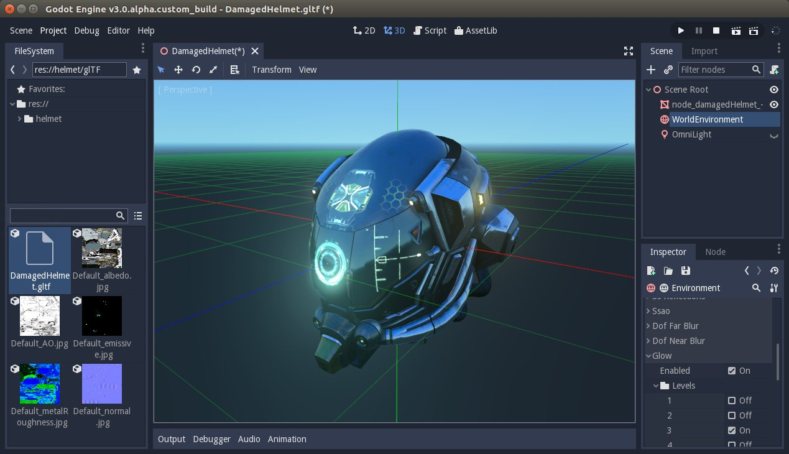
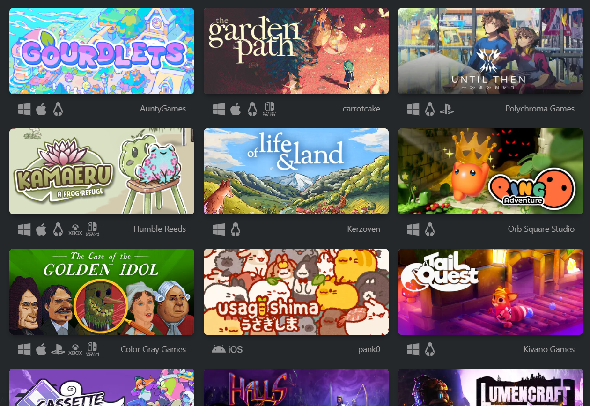

[**🏠 Home**](../README.md) | [**Godot Fundamentals ▶️**](../02_Godot_Fundamentals/02_Godot_Fundamentals.md)

### [**Overview of Godot 4 and Mobile App Development**](#overview-of-godot-4-and-mobile-app-development-1)

- [**Introduction to Godot engine**](#introduction-to-godot-engine)
- [**Mobile App Development with Godot**](#mobile-app-development-with-godot)
- [**Made with Godot**](#made-with-godot)

# **Overview of Godot 4 and Mobile App Development**

## **Introduction to Godot Engine**

Godot Engine is a free and open-source, cross-platform game engine that well known for its flexibility, ease of use, and powerful features. Though it is primarily designed for game development, Godot has evolved to support a wide range of applications, including non-game apps and user interfaces (UIs). 

Offcial Website: https://godotengine.org/

Official community: https://godotengine.org/community/

### Key features of Godot

- **Open Source:** Godot is completely free and open-source, licensed under the MIT license. This means you can use, modify, and distribute it without any restrictions.

- **Cross-Platform:** Godot supports multiple platforms, including Windows, macOS, Linux, Android, iOS, and HTML5, making it a versatile choice for developers.

- **Node-Based Architecture:** Godot uses a unique node-based architecture, where everything component is a node. This modular approach allows for easy composition and reuse of components.

- **2D and 3D Support:** Godot provides range tools for both 2D and 3D development.

- **Scripting:** Godot supports multiple scripting languages, including GDScript (a Python-like language), C#, and C++. GDScript is particularly popular due to its simplicity and tight integration with the engine.

- **Light Weight:** Unlike the other game engines, Godot engine is extremely light weight. Whole Godot 4 engine binary is just over 100MB.

- **Community and Resources:** Godot has a thriving community of developers who contribute to its development and provide extensive resources, tutorials, and plugins.

Godot features: https://godotengine.org/features/

## **Mobile App Development with Godot**

Godot Engine is not only a popular choice for game development but also offers a viable solution for creating mobile applications. While its primary focus is on gaming, its features and flexibility make it suitable for building mobile app projects.

### Why Use Godot for Mobile Apps

- **Godot is fun:** Godot is a fun and extremly easy game engine that makes creating games/apps enjoyable and accessible.

- **Learning Curve:** Godot's user-friendly interface and clear documentation make it easier to learn for even beginners.

- **Cross-Platform Development:** Godot's ability to target multiple platforms (Windows, Mac, iOS, Android, and more) from a single codebase significantly reduces development time and effort.

- **Rich Feature Set:** Godot provides a comprehensive set of tools for UI design, animations, physics, and more, which are essential for creating engaging mobile apps.

- **Open-Source and Community Support:** As an open-source project, Godot benefits from a large and active community that contributes to its development and provides valuable resources.

## Made with Godot

Godot showcase: https://godotengine.org/showcase/

Godot offers a powerful and efficient solution for mobile app development, especially if you prioritize cross-platform compatibility, performance, and a rich feature set. Its open-source nature, strong community support, and accessibility make it a compelling choice for developers of all levels.

[**🏠 Home**](../README.md) | [**Godot Fundamentals ▶️**](../02_Godot_Fundamentals/02_Godot_Fundamentals.md)