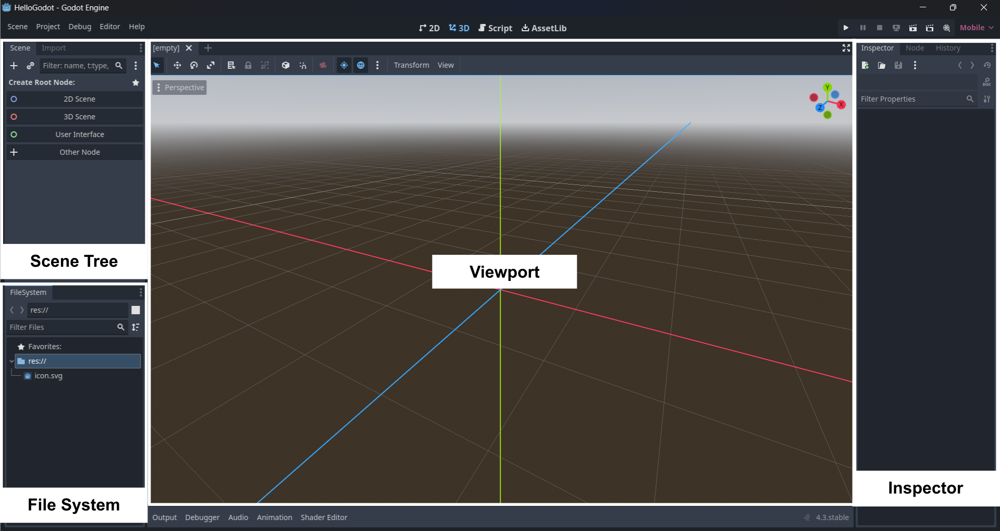

[**🏠 Home**](../README.md) | [**◀️ Overview of Godot 4 and Mobile App Development**](../01_Overview_of_Godot_4_and_Mobile_App_Development/01_Overview_of_Godot_4_and_Mobile_App_Development.md) | [**Godot Fundamentals ▶️**](../02_Godot_Fundamentals/02_Godot_Fundamentals.md)

- ### [**Godot Fundamentals**](#godot-fundamentals-1)

    - [**Installing Godot 4**](#installing-godot-4)

    - [**Creating a New Project in Godot**](#create-your-first-project)

    - [**Exploring the Godot Interface**](#exploring-the-godot-interface)
    
    - [**Building Blocks of a Godot Project**](#building-blocks-of-a-godot-project)

# **Godot Fundamentals**

## **Installing Godot 4**

### Download Godot

To get started, head over to [official Godot download](https://godotengine.org/download/) page and download the appropriate version for your operating system. Godot is available for Windows, macOS, and Linux (+ Even for Android).

### Extract the Files

Once the download is complete, extract the files to a folder on your computer. Godot doesn’t require installation—it’s a self-contained executable.

### Launch Godot

Once installed, launch Godot. You'll be greeted with the project manager window, which will allow you to create or open projects.

Godot project manager window

## **Create Your First Project**

Creating a new Godot project is really easy:

1. In the Godot project manager and click on the "New Project" button.
2. Name your project (Ex: "HelloGodot") and choose a directory to save it.
3. Ensure the renderer is set to "Mobile" for mobile apps, which is optimized for rendering in mobile devices.
4. Click "Create & Edit" to enter the main editor.

Create new project

## **Exploring the Godot Interface**

When you launch the Godot editor for the first time, you’ll encounter its well-organized, user-friendly interface. Here's a breakdown of the key sections you'll use:

- **Scene Tree**: This is where all your app’s elements, controls, and other components are listed. It displays a hierarchical structure of the current scene.
- **Inspector**: This panel shows properties and settings for the currently selected node.
- **Viewport**: The viewport is the central work area where you visually design your user interface, place controls, and preview your app.
- **File System**: This pane will show all the files, resources and scripts in your project.

Godot interface

## **Building blocks of a Godot project**

### Nodes

A node is a fundamental building block in Godot. Each node represents an element of your app, such as a sprite, sound, physics body, or UI element. Nodes have properties, methods, and signals, and they are organized hierarchically. Every scene in Godot is built using nodes, and the relationships between them form a scene tree.

Example node types: Sprite, KinematicBody, Label, Camera, etc.
Nodes can inherit functionality from other nodes.

Nodes in the Scene tree

### Scenes

A scene is a collection of nodes organized in a tree. In Godot, a scene can represent anything from a UI element, or a complete page. Scenes can be reused and combined to create complex structures.

Scenes are a way to group nodes that work together.
You can load and instance scenes during runtime, making them highly modular.

### Instances

Instancing refers to the process of creating a copy (or instance) of a scene to use multiple times in your app. Instances are useful for reusing elements without having to duplicate code or assets. You can modify each instance individually if needed.

### Resources

Resources are data containers that can be reused across different nodes or scenes. They are used to store things like graphics, scripts, sounds, and more. Resources can be shared between scenes, reducing memory usage and improving performance.

[**🏠 Home**](../README.md) | [**◀️ Overview of Godot 4 and Mobile App Development**](../01_Overview_of_Godot_4_and_Mobile_App_Development/01_Overview_of_Godot_4_and_Mobile_App_Development.md) | [**Godot Fundamentals ▶️**](../02_Godot_Fundamentals/02_Godot_Fundamentals.md)