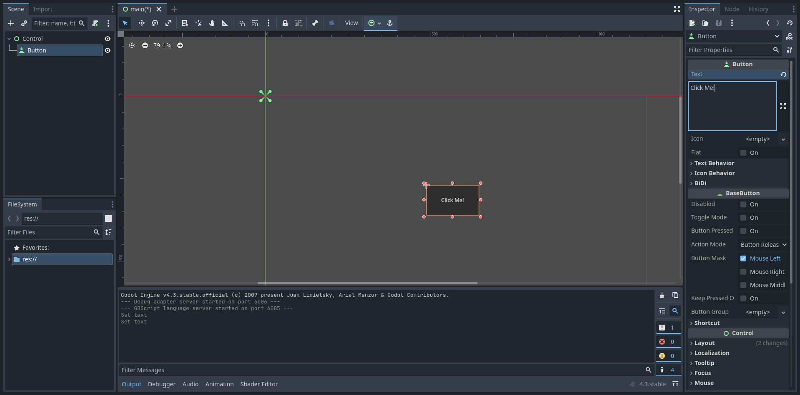
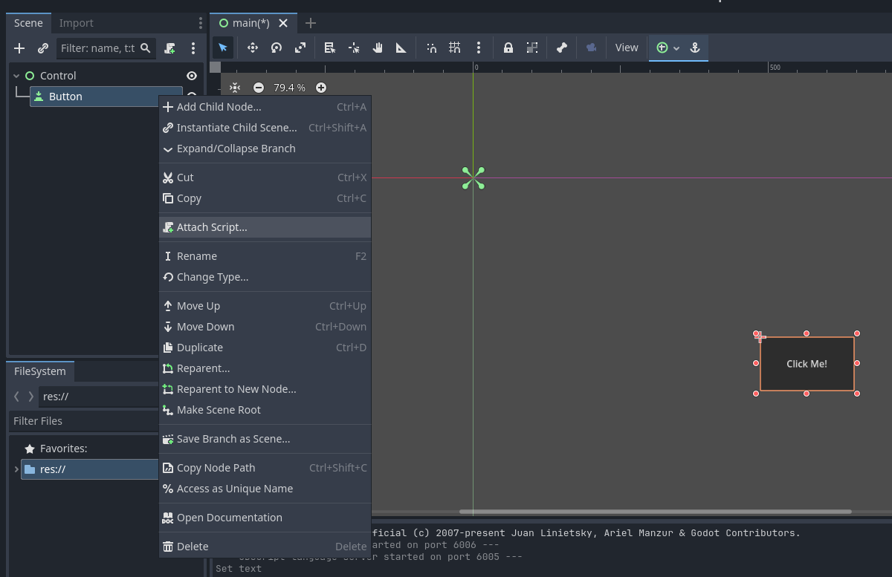
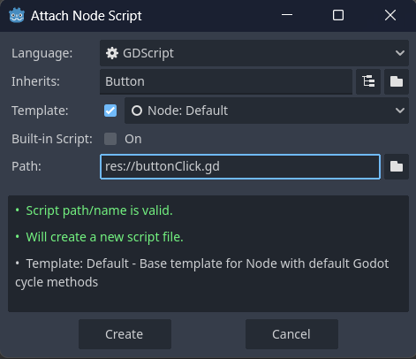
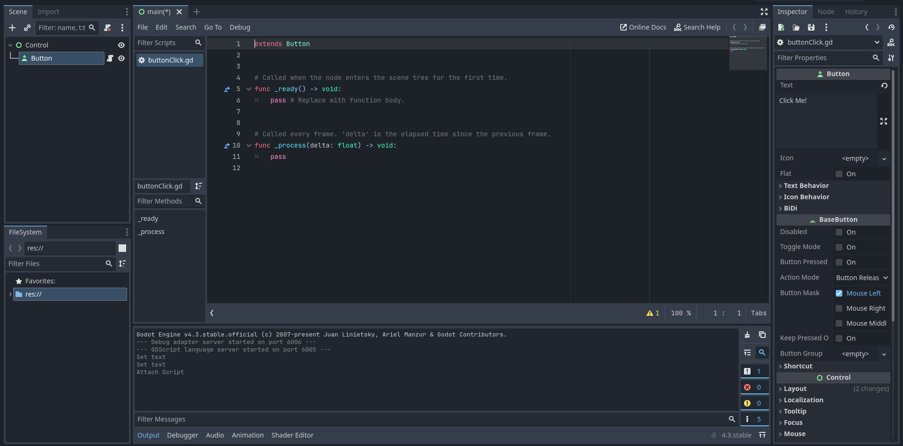
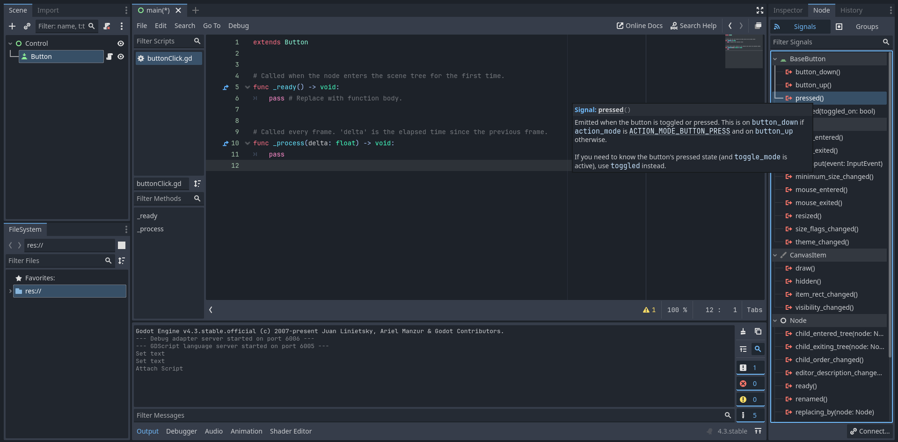
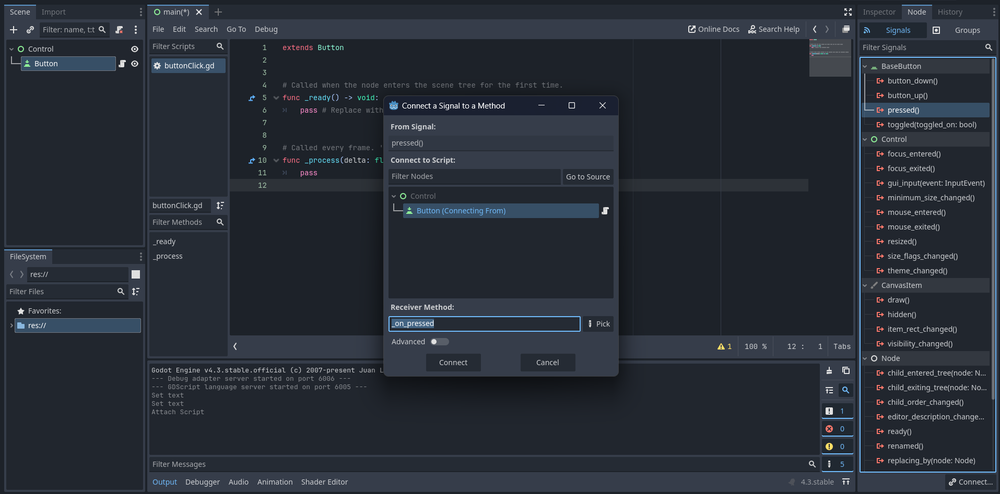
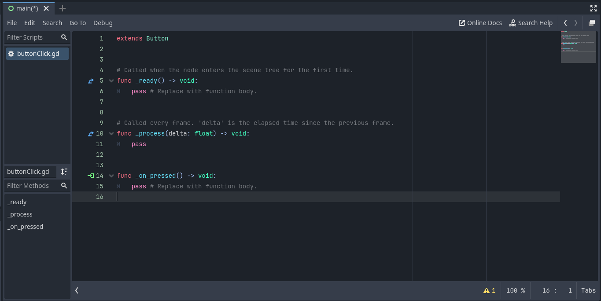
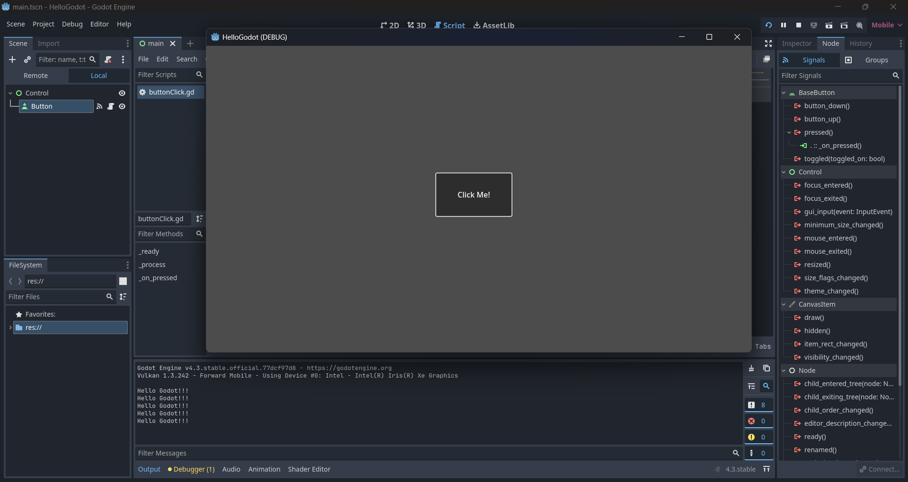

[**🏠 Home**](../README.md) | [**◀️ Godot Fundamentals**](../02_Godot_Fundamentals/02_Godot_Fundamentals.md) | [**Project Setup for Mobile Development ▶️**](../04_Project_Setup_for_Mobile_Development/04_Project_Setup_for_Mobile_Development.md)


- ### [**GDScript Fundamentals**](#gdscript-fundamentals-1)

    - [**Scripting with GDScript**](#scripting-with-gdscript)

    - [**Variables, Operators, Arrays, Dictionaries**](#variables-operators-arrays-dictionaries)

    - [**Functions, Control Statements, Classes**](#functions-control-statements-classes)


# **GDScript Fundamentals**

GDScript is the primary scripting language used in the Godot game engine. It's designed to be easy to learn. It is a high-level, dynamically typed language similar to Python in syntax, allowing users to control logic, nodes, and scenes within Godot. We'll explore the fundamental concepts of GDScript, from basic syntax to more advanced features.

## **Scripting with GDScript**

In Godot, scripts are typically attached to nodes, which are the building blocks of a scene. Each node can be controlled or manipulated by attaching a GDScript file to it. 

**Example**

Let's use GDScript to handle button click and print text to the console.

- Create a new Godot project and add Button node to the scene.

    

- Let's attach a script to the Button node. Right click on the button node and select "Attach Script".

    

    This will show "Attach Node Script" dialog box. Enter a name to the script file you need to create and attach to the button and then click "Create". Here I have named the script "nuttonClick.gd".

    

    This will create the script file and open the script editor.

    

    Now we need to access button press event from the script.
    Select the button on the scene tree, then bouble click on "pressed()" signal on the node signals panel on the right of the window.

    

    This will show a dialog box to create a new function connecting to the press signal. 

    

    This creates a new finction "_on_pressed()"

    

    Now enter the code you need to run when the button is pressed. Let's print something to the console.

    ```gdscript
    func _on_pressed() -> void:
	    print("Hello Godot!!!")
    ```

    That's it. Now run the project and click on the button.
    "Hello Godot!!!" will be printed into the console everytime you click on the button.

    

### Basic Syntax

GDScript uses indentation to define code blocks, similar to Python.

```gdscript
func greet():
    print("Hello Godot!")

greet()  # Output: Hello Godot!
```

### Comments

Comments in GDScript start with a `#` for single-line comments. For multi-line comments, use triple quotes.

```gdscript
# This is a single-line comment

var x = 5  # You can also add comments at the end of a line

"""
This is a multi-line comment.
It can span several lines.
"""
```

## **Variables, Operators, Arrays, Dictionaries**

### **Variables**

#### Declaring Variables

In GDScript, you can declare variables using the `var` keyword:

```gdscript
var health = 100
var player_name = "Alice"
var is_alive = true
```

GDScript is dynamically typed, meaning you don't need to specify the type of the variable. However, you can use type hints for better code clarity and performance:

```gdscript
var score: int = 0
var player_name: String = "Bob"
var gravity: float = 9.8
```

#### Basic Data Types

- Integers: `var age = 30`
- Floats: `var pi = 3.14`
- Strings: `var greeting = "Hello"`
- Booleans: `var is_game_over = false`

#### Constants

Use the `const` keyword to declare constants:

```gdscript
const MAX_SPEED = 500
const GRAVITY = 9.8
```

### **Operators**

#### Arithmetic Operators

- Addition: `+`
- Subtraction: `-`
- Multiplication: `*`
- Division: `/`
- Integer Division: `/`
- Modulo: `%`
- Exponentiation: `**`

Example:

```gdscript
var a = 10
var b = 3
print(a + b)  # 13
print(a - b)  # 7
print(a * b)  # 30
print(a / b)  # 3.333333
print(a // b) # 3 (integer division)
print(a % b)  # 1
print(a ** b) # 1000
```

#### Comparison Operators

- Equal to: `==`
- Not equal to: `!=`
- Greater than: `>`
- Less than: `<`
- Greater than or equal to: `>=`
- Less than or equal to: `<=`

Example:

```gdscript
var x = 5
var y = 10
print(x == y)  # false
print(x != y)  # true
print(x < y)   # true
print(x >= y)  # false
```

#### Logical Operators

- AND: `and`
- OR: `or`
- NOT: `not`

Example:

```gdscript
var is_sunny = true
var is_warm = false

if is_sunny and is_warm:
    print("Perfect day for a picnic!")
elif is_sunny or is_warm:
    print("It's a nice day.")
else:
    print("Stay inside.")

print(not is_warm)  # true
```

### **Arrays**

Arrays in GDScript are dynamic and can hold multiple data types.

#### Creating Arrays

```gdscript
var empty_array = []
var numbers = [1, 2, 3, 4, 5]
var mixed = [1, "two", 3.0, [4, 5]]
```

#### Accessing and Modifying Arrays

```gdscript
var fruits = ["apple", "banana", "cherry"]
print(fruits[0])  # apple

fruits[1] = "blueberry"
print(fruits)  # ["apple", "blueberry", "cherry"]

fruits.append("date")
print(fruits)  # ["apple", "blueberry", "cherry", "date"]

fruits.pop_back()
print(fruits)  # ["apple", "blueberry", "cherry"]
```

#### Array Methods

GDScript provides several built-in methods for working with arrays:

```gdscript
var numbers = [3, 1, 4, 1, 5, 9, 2, 6]
print(numbers.size())  # 8
print(numbers.max())   # 9
print(numbers.min())   # 1
numbers.sort()
print(numbers)  # [1, 1, 2, 3, 4, 5, 6, 9]
```

### **Dictionaries**

Dictionaries are collections of key-value pairs.

#### Creating Dictionaries

```gdscript
var empty_dict = {}
var player = {
    "name": "Alice",
    "health": 100,
    "items": ["sword", "shield"]
}
```

#### Accessing and Modifying Dictionaries

```gdscript
print(player["name"])  # Alice

player["health"] = 90
print(player["health"])  # 90

player["level"] = 5
print(player)  # {"name": "Alice", "health": 90, "items": ["sword", "shield"], "level": 5}
```

#### Dictionary Methods

```gdscript
print(player.has("name"))  # true
print(player.keys())  # ["name", "health", "items", "level"]
print(player.values())  # ["Alice", 90, ["sword", "shield"], 5]
```

## **Functions, Control Statements, Classes**

### **Functions**

Functions in GDScript are defined using the `func` keyword.

#### Basic Function Syntax

```gdscript
func greet(name):
    print("Hello, " + name + "!")

greet("Alice")  # Output: Hello, Alice!
```

#### Return Values

```gdscript
func add(a, b):
    return a + b

var result = add(3, 4)
print(result)  # 7
```

#### Default Arguments

```gdscript
func power(base, exponent=2):
    return base ** exponent

print(power(3))     # 9
print(power(3, 3))  # 27
```

#### Variable Number of Arguments

```gdscript
func sum_all(*numbers):
    var total = 0
    for num in numbers:
        total += num
    return total

print(sum_all(1, 2, 3, 4, 5))  # 15
```

### **Control Statements**

#### If-Elif-Else Statements

```gdscript
var score = 85

if score >= 90:
    print("A")
elif score >= 80:
    print("B")
elif score >= 70:
    print("C")
else:
    print("F")
```

#### For Loops

```gdscript
for i in range(5):
    print(i)  # Prints 0, 1, 2, 3, 4

var fruits = ["apple", "banana", "cherry"]
for fruit in fruits:
    print(fruit)
```

#### While Loops

```gdscript
var count = 0
while count < 5:
    print(count)
    count += 1
```

#### Match Statements (Switch-Case Equivalent)

```gdscript
var command = "jump"

match command:
    "walk":
        print("Walking...")
    "jump":
        print("Jumping!")
    "attack":
        print("Attacking!")
    _:
        print("Unknown command")
```

### **Classes**

GDScript is an object-oriented language, and classes are a fundamental part of it.

#### Defining a Class

```gdscript
class_name Player

var health = 100
var name = ""

func _init(player_name):
    name = player_name

func take_damage(amount):
    health -= amount
    if health <= 0:
        print(name + " has been defeated!")

func heal(amount):
    health = min(health + amount, 100)
```

#### Using a Class

```gdscript
var player1 = Player.new("Alice")
player1.take_damage(20)
print(player1.health)  # 80
player1.heal(10)
print(player1.health)  # 90
```

This chapter has covered the fundamental concepts of GDScript, from basic syntax and data types to more advanced topics like functions, control structures, and object-oriented programming. With these foundations, you're well-equipped to start creating games and UI experiences in Godot.


[**🏠 Home**](../README.md) | [**◀️ Godot Fundamentals**](../02_Godot_Fundamentals/02_Godot_Fundamentals.md) | [**Project Setup for Mobile Development ▶️**](../04_Project_Setup_for_Mobile_Development/04_Project_Setup_for_Mobile_Development.md)