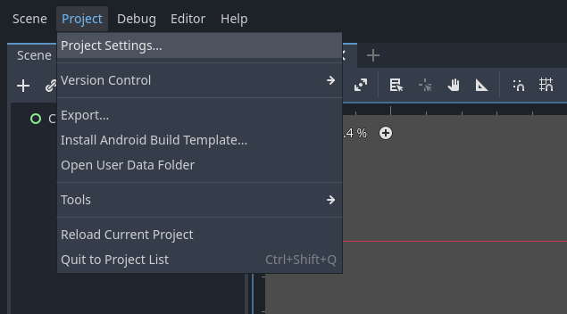
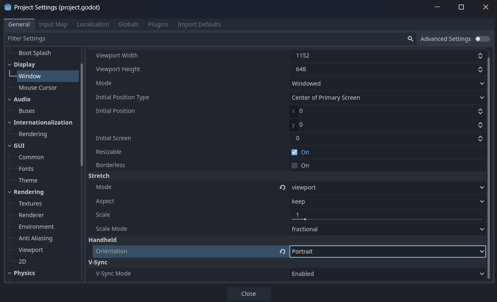
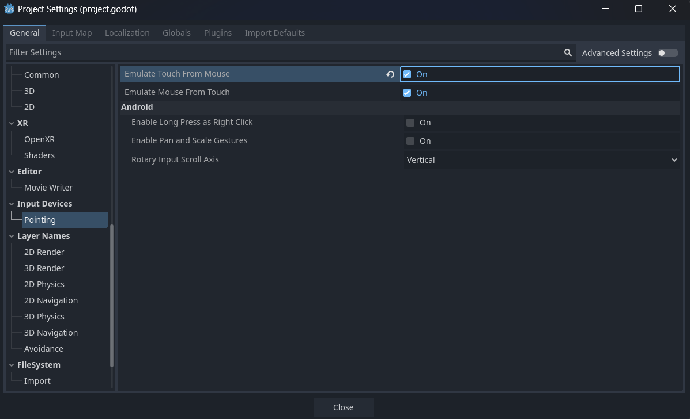

[**🏠 Home**](../README.md) | [**◀️ GDScript Fundamentals**](../03_GDScript_Fundamentals/03_GDScript_Fundamentals.md) | [**UI Nodes and Controls ▶️**](../05_UI_Nodes_and_Controls/05_UI_Nodes_and_Controls.md)


- ### [**Project Setup for Mobile Development**](#project-setup-for-mobile-development-1)
    - [**Mobile App Development Workflow with Godot**](#mobile-app-development-workflow-with-godot)
    - [**Project Setup and Configuration for Mobile Development**](#project-setup-and-configuration-for-mobile-development)
    - [**Exporting for Android**](#exporting-for-android)


# **Project Setup for Mobile Development**

Mobile app development with Godot Engine offers a powerful and flexible way to create apps for Android and iOS devices. This chapter will guide you through the process of setting up your first Godot project for mobile development, configuring it properly, and exporting it for Android platforms.

## **Mobile App Development Workflow with Godot**

The mobile app development workflow in Godot follows these general steps:

1. **Project Setup**: Create and configure your Godot project for mobile development.
2. **Development**: Build your app using GDScript, the Godot editor, and mobile-specific considerations.
3. **Testing**: Use the Godot simulator or deploy to a physical device for testing.
4. **Optimization**: Adjust your app for mobile performance and user experience.
5. **Export**: Prepare your app for distribution on mobile platforms.

### Key Considerations for Mobile Development

When developing for mobile platforms, keep these factors in mind:

- **Screen Sizes**: Mobile devices come in various sizes and resolutions, so design your UI to be resolution-independent by using anchors and margins in the UI, and avoid hard-coding positions.
- **Touch Input**: Implement touch controls instead of keyboard/mouse inputs.
- **Performance**: Mobile devices have limited resources compared to desktops, so you need to optimize your app for performance. Reduce texture sizes, limit draw calls, and ensure efficient use of resources.
- **File Size**: Keep your app's file size reasonable for mobile downloads.

## **Project Setup and Configuration for Mobile Development**

Let's walk through setting up a new Godot project for mobile development.

### Creating a New Project

1. Open Godot Engine
2. Click on "New Project"
3. Choose a project name and location
4. Select "Mobile" as the renderer (GLES2 for wider device compatibility or GLES3 for more advanced features)
5. Click "Create & Edit"

### Configuring Project Settings

Once your project is created, we need to configure it for mobile development:

- Go to "Project" > "Project Settings"
   

- Navigate to the "Display" section:
   - Set "Window" > "Size" > "Width" and "Height" to your target resolution (e.g., 1920x1080)
   - Set "Window" > "Handheld" > "Orientation" to "Portrait" or "Landscape"

   

- Navigate to the "Input Devices" section:
   - Enable "Pointing" > "Emulate Touch From Mouse" for testing touch input on desktop

   

## **Exporting for Android**

To export your Godot project for Android, you'll need to set up your development environment first.

### Setting Up the Android Build Environment

1. **Install the OpenJDK**:
   - Download and install [OpenJDK](https://adoptium.net/temurin/releases/?variant=openjdk17)

2. **Install the Android SDK**:
   - Download and install Android Studio (which includes the SDK)
   - Use the SDK Manager to install the appropriate Android SDK version

3. **Install the Android Build Tools**:
   - In the SDK Manager, install the latest Android Build Tools

4. **Install the Android NDK**:
   - In the SDK Manager, install the Android NDK

5. **Set Up Godot for Android Export**:
   - In Godot, go to "Editor" > "Editor Settings" > "Export" > "Android"
   - Set the paths for the Android SDK, NDK, and Build Tools

### Creating an Android Export Template

1. Go to "Project" > "Export"
2. Click "Add" and select "Android"
3. Configure the following settings:
   - **Package**: Set a unique identifier (Ex: com.yourstudio.appname)
   - **Version Code**: Set to 1 (increment for each update)
   - **Version Name**: Set to "1.0" (or your preferred version string)
   - **Permissions**: Add any required permissions (Ex: INTERNET for online features)

### Customizing the Android Export

You can further customize your Android export:

1. **Icon**: Set a custom icon for your app in the "Icon" section
2. **Splash Screen**: Configure a splash screen in the "Launch Screens" section
3. **Screen Sizes**: In the "Screen" section, ensure "Expand To Keep Screen Safe" is enabled

### Exporting the APK

1. In the "Export" dialog, click "Export Project"
2. Choose a location and name for your APK file
3. Click "Save"

Godot will now build your Android APK. This process may take a few minutes.

### Testing on an Android Device

To test your exported APK:

1. Enable "Developer Options" and "USB Debugging" on your Android device
2. Connect your device to your computer via USB
3. Install the APK using adb:
   ```
   adb install path/to/your/App.apk
   ```

Alternatively, you can transfer the APK to your device and install it directly.

Also checkout the [Official docs on exporting for Android](https://docs.godotengine.org/en/stable/tutorials/export/exporting_for_android.html)

You've now set up your Godot project for mobile development and learned how to export it for Android.


[**🏠 Home**](../README.md) | [**◀️ GDScript Fundamentals**](../03_GDScript_Fundamentals/03_GDScript_Fundamentals.md) | [**UI Nodes and Controls ▶️**](../05_UI_Nodes_and_Controls/05_UI_Nodes_and_Controls.md)