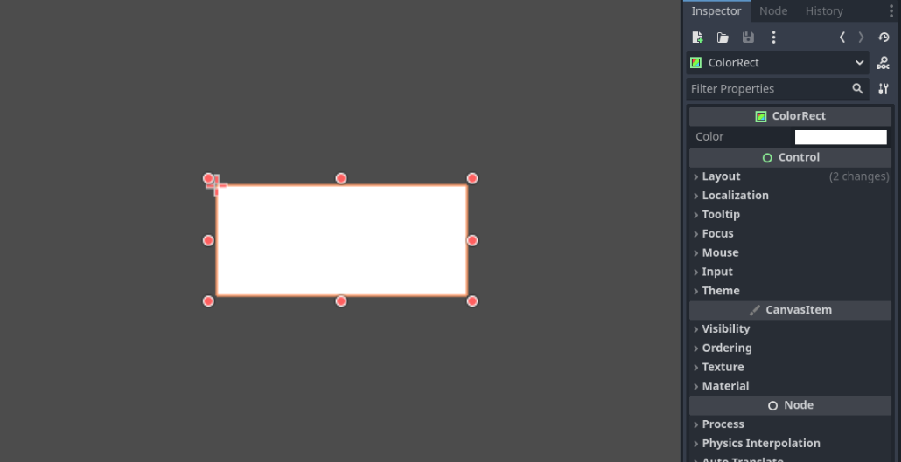

[**🏠 Home**](../README.md) | [**◀️ Project Setup for Mobile Development**](../04_Project_Setup_for_Mobile_Development/04_Project_Setup_for_Mobile_Development.md) | [**Project Setup for Mobile Development ▶️**](../04_Project_Setup_for_Mobile_Development/04_Project_Setup_for_Mobile_Development.md)


- ### [**05: UI Nodes and Controls**](#ui-nodes-and-controls)
    - [**Introduction to Control Nodes**](#introduction-to-control-nodes)
    - [**Basic UI elements**](#basic-ui-elements)
        - Button, Label, TextEdit, LineEdit, Panel, ItemList
    - [**Visual Rect Nodes**](#visual-rect-nodes)
        - ColorRect, TextureRect, NinePatchRect 


# UI Nodes and Controls

In this chapter, we will dive deep into Godot's control nodes, exploring the essential UI elements. UI nodes are an integral part of creating interactive mobile apps, allowing users to interact with your app through various interface elements.

## **Introduction to Control Nodes**

In Godot, **Control** nodes are the building blocks for creating user interfaces. These nodes allow you to create anything from simple buttons to complex menus. The most important thing to remember is that Control nodes are part of the **CanvasItem** class and are used to manage 2D UI elements. Control nodes handle things like layout, anchoring, and input events automatically, making them easy to use.

Some key features of Control nodes:
- **Anchoring**: Ensures that your UI elements resize and reposition correctly based on screen size.
- **Margins**: Helps set padding or spacing between elements.
- **Themes**: Allows you to customize the appearance of UI elements globally or individually.
- **Focus and Input Handling**: Control nodes can respond to input events (mouse, touch, keyboard) and handle focus.

Let's explore some of the most important basic UI elements in Godot.

## **Basic UI Elements**

Godot 4 provides a wide variety of **Basic UI controls** that you can use to create a polished user interface for your mobile app. Let’s look at some of the most frequently used ones:

- **Button:** Buttons are one of the simplest and most essential elements in any mobile UI.

    

    The BaseButton class extends to several other types of buttons.

    

    **Scripting Example:**
    ```gdscript
    func _on_button_pressed():
        print("Button clicked!")
    ```


- **Label:** Used to display non-interactive text.

    

    **Scripting Example:**
    ```gdscript
    $Label.text = "Welcome to the App"
    ```

- **TextEdit:** A multiline text box that allows users to input or display long-form text.

    

    **Scripting Example:**
    ```gdscript
    func _on_textedit_text_changed(new_text):
        print("Text entered:", new_text)
    ```

- **LineEdit:** A single-line text field for short user inputs like names, passwords, or search queries.

    

    **Scripting Example:**
    ```gdscript
    func _on_lineedit_text_changed(new_text):
        print("Line edit text:", new_text)
    ```

- **Panel:** A container that holds other UI elements. It helps group related items and can be styled to look like a box or a card.

- **ItemList:** Displaying lists of selectable items. It automatically handles selection logic and can display text, icons, or both.

    

    **Scripting Example:**
    ```gdscript
    $ItemList.add_item("Option 1")
    $ItemList.add_item("Option 2")
    ```

## **Visual Rect Nodes**

In addition to basic controls, Godot also provides nodes that are specifically designed for visual displays and textures. These nodes can enhance the aesthetic design of your mobile app.

- **ColorRect:** A simple rectangle that you can fill with a solid color. It’s useful for background colors or decorative purposes.

    

    **Scripting Example:**
    ```gdscript
    $ColorRect.color = Color(0.5, 0.2, 0.8) # Purple color
    ```

- **TextureRect:** Used to display images or textures. This is especially useful for adding logos, icons, or any image-based content.

    

    **Scripting Example:**
    ```gdscript
    $TextureRect.texture = load("res://icon.png")
    ```

- **NinePatchRect** A special type of TextureRect that allows you to scale images without distorting the corners. This is useful for creating scalable UI elements like buttons or panels.

    

    **Scripting Example:**
    ```gdscript
    $NinePatchRect.texture = load("res://button_bg.png")
    $NinePatchRect.stretch_margin_left = 5
    $NinePatchRect.stretch_margin_right = 5
    ```


[**🏠 Home**](../README.md) | [**◀️ Project Setup for Mobile Development**](../04_Project_Setup_for_Mobile_Development/04_Project_Setup_for_Mobile_Development.md) | [**Project Setup for Mobile Development ▶️**](../04_Project_Setup_for_Mobile_Development/04_Project_Setup_for_Mobile_Development.md)