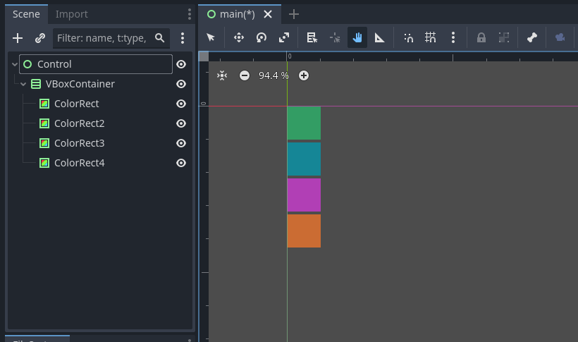

[**🏠 Home**](../README.md) | [**◀️ UI Nodes and Controls**](../05_UI_Nodes_and_Controls/05_UI_Nodes_and_Controls.md) | [**UI Nodes and Controls ▶️**](../05_UI_Nodes_and_Controls/05_UI_Nodes_and_Controls.md)


- ### [**Layouts and Containers**](#layouts-and-containers)
    - [**Containers**](#containers)
    - [**Anchors and Margins**](#anchors-and-margins)
    - [**Creating Responsive Layouts**](#creating-responsive-layouts)
        - Best practices
        - Project settings
        - Script-based adjustments


# **Layouts and Containers**

In the chapter, we dive into the essential tools for organizing and managing user interface elements in Godot. Exploring various container nodes which help creating structured and responsive layouts. 


Image source: [uxdesigninstitute.com](https://www.uxdesigninstitute.com/blog/ultimate-guide-to-mobile-app-design/)

## **Containers**

Containers are special types of UI nodes that automatically arrange their children in a specific manner.

- **Container:** The base class for all container nodes. It doesn't do anything by itself but provides a foundation for other containers.
    
    

- **PanelContainer:** Adds a panel background to its child node, useful for creating framed sections.

    

- **VBoxContainer:** Arranges its children vertically.

    

- **HBoxContainer:** Arranges its children horizontally.

    

- **GridContainer:** Arranges its children in a grid format, with a specified number of columns.

    

- **CenterContainer:** Centers its child node within itself.

    

- **MarginContainer:** Adds margins around its child node.

    

- **AspectRatioContainer:** Maintains a specific aspect ratio for its child node, useful for responsive design.

    

- **ScrollContainer:** Provides a scrollable area for its child nodes, essential for handling content that exceeds the screen size.

    

## **Anchors and Margins**

Anchors and margins are essential for creating flexible and adaptive UIs. They allow you to define how UI elements resize and reposition relative to their parent container.

- **Anchors:** Define the position of a UI element relative to its parent. You can set the anchor points to the corners or edges of the parent container.
    
- **Margins:** Define the space between a UI element and its parent container. Margins can be set for the top, bottom, left, and right sides of the element.


Anchor presets


Image Source: [Godot Docs](https://docs.godotengine.org/en/3.1/getting_started/step_by_step/ui_introduction_to_the_ui_system.html)

## **Creating Responsive Layouts**

Responsive layouts are crucial for mobile applications to ensure that the UI adapts to different screen sizes and orientations. 

### Best Practices

Tips for creating responsive layouts in Godot:

- **Design for Smallest Screen:** Determine the minimum screen size you want to support. Create a layout that fits comfortably on the smallest screen size as the foundation and adapt to higher resolutions.
- **Use Containers Wisely:** Combine different containers to create flexible and adaptive layouts. For example, use a `VBoxContainer` inside a `ScrollContainer` to create a vertically scrollable list.
- **Anchors and Margins:** Adjust anchors and margins to ensure UI elements resize and reposition correctly on different screen sizes.
- **AspectRatioContainer:** Use this container to maintain the aspect ratio of critical UI elements, ensuring they look good on all devices.
- **Responsive Design Principles:** Follow general responsive design principles such as fluid grids and flexible images.

### Project Settings

Project settings in Godot engine influence app layout and responsiveness by determining the viewport size, aspect ratio, and scaling mode, which directly affect how content is displayed and adapted to different screen sizes and orientations.

-  **Window Size:** Set the default window size in Project Settings > Display > Window. This is the base resolution your app will use.

- **Stretch Mode:** Determines how the game content is stretched to fit the window. Common options include:
    - **2D:** Scales the content uniformly, maintaining the aspect ratio.
    - **Viewport:** Scales the entire viewport, which can result in non-uniform scaling.

- **Stretch Aspect:** Defines how the aspect ratio is handled. Options include:
    - **Ignore:** Ignores the aspect ratio, stretching the content to fill the window.
    - **Keep:** Maintains the aspect ratio, adding black bars if necessary.
    - **Keep Width:** Maintains the width, adjusting the height.
    - **Keep Height:** Maintains the height, adjusting the width.


### Script-Based Adjustments

You can use GDScript to make dynamic adjustments based on the screen resolution. Here’s an example of how to adjust UI elements based on the screen size:

```gdscript
extends Control

func _ready():
    adjust_ui()

func adjust_ui():
    var screen_size = OS.window_size
    if screen_size.x / screen_size.y > 1.5:
        # Adjust for wider screens
        $myContainer.rect_min_size = Vector2(800, 600)
    else:
        # Adjust for narrower screens
        $myContainer.rect_min_size = Vector2(600, 800)
```

Thorough testing and adjustments are essential to ensure a consistent and enjoyable user experience accross a wide range of devices and screen resolutions.

Further reading: [UI Grid Best Practices](https://blog.prototypr.io/ui-grid-best-practices-efd6c4f9d16)


[**🏠 Home**](../README.md) | [**◀️ UI Nodes and Controls**](../05_UI_Nodes_and_Controls/05_UI_Nodes_and_Controls.md) | [**UI Nodes and Controls ▶️**](../05_UI_Nodes_and_Controls/05_UI_Nodes_and_Controls.md)