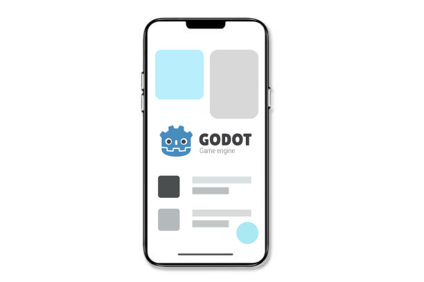
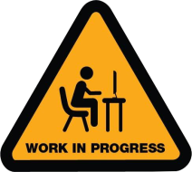

  

# Mobile App Development with Godot 4

Welcome to "Mobile App Development with Godot 4"! Complete beginner's guide to mobile app development using the powerful Godot 4 engine. Start by learning the essentials, including UI creation, scene management, and scripting with GDScript. This course will give you the tools and knowledge to create beautiful, functional mobile applications. Join us on this journey and unlock the potential of Godot 4 for mobile app development!  

📌 **Notice**

This is kind of my learning diary, where I am compiling a series of lessons that bring together all the knowledge I have acquired from various scattered sources, including books, articles, websites, YouTube videos, and more. My goal is to create a comprehensive course that consolidates this information, making it easier for others to access and learn from as they progress in their journey of learning Mobile app development with Godot 4 from the basics to a level where they can confidently use it to build real apps. Hope this helps🙂

  

## **📑 Contents**

## **Phase 1: Introduction to Godot 4 and Mobile App Development**

- ### [**01: Overview of Godot 4 and Mobile App Development**](./01_Overview_of_Godot_4_and_Mobile_App_Development/01_Overview_of_Godot_4_and_Mobile_App_Development.md)

    - [**Introduction to Godot engine**](./01_Overview_of_Godot_4_and_Mobile_App_Development/01_Overview_of_Godot_4_and_Mobile_App_Development.md#introduction-to-godot-engine)
    - [**Mobile App Development with Godot**](./01_Overview_of_Godot_4_and_Mobile_App_Development/01_Overview_of_Godot_4_and_Mobile_App_Development.md#mobile-app-development-with-godot)
    - [**Made with Godot**](./01_Overview_of_Godot_4_and_Mobile_App_Development/01_Overview_of_Godot_4_and_Mobile_App_Development.md#made-with-godot)

- ### [**02: Godot Fundamentals**](./02_Godot_Fundamentals/02_Godot_Fundamentals.md)
    - [**Installing Godot 4**](./02_Godot_Fundamentals/02_Godot_Fundamentals.md#installing-godot-4)
    - [**Creating a New Project in Godot**](./02_Godot_Fundamentals/02_Godot_Fundamentals.md#create-your-first-project)
    - [**Exploring the Godot Interface**](./02_Godot_Fundamentals/02_Godot_Fundamentals.md#exploring-the-godot-interface)
    - [**Building Blocks of a Godot Project**](./02_Godot_Fundamentals/02_Godot_Fundamentals.md#building-blocks-of-a-godot-project)
    - [**Build a Simple Godot UI Project**](./02_Godot_Fundamentals/02_Godot_Fundamentals.md#build-a-simple-godot-ui-project)

- ### [**03: GDScript Fundamentals**](./03_GDScript_Fundamentals/03_GDScript_Fundamentals.md)
    - [**Scripting with GDScript**](./03_GDScript_Fundamentals/03_GDScript_Fundamentals.md#scripting-with-gdscript)
    - [**Variables, Operators, Arrays, Dictionaries**](./03_GDScript_Fundamentals/03_GDScript_Fundamentals.md#variables-operators-arrays-dictionaries)
    - [**Functions, Control Statements, Classes**](./03_GDScript_Fundamentals/03_GDScript_Fundamentals.md#functions-control-statements-classes)

- ### [**04: Project Setup for Mobile Development**](./04_Project_Setup_for_Mobile_Development/04_Project_Setup_for_Mobile_Development.md)
    - [**Mobile App Development Workflow with Godot**](./04_Project_Setup_for_Mobile_Development/04_Project_Setup_for_Mobile_Development.md#mobile-app-development-workflow-with-godot)
    - [**Project Setup and Configuration for Mobile Development**](./04_Project_Setup_for_Mobile_Development/04_Project_Setup_for_Mobile_Development.md#project-setup-and-configuration-for-mobile-development)
    - [**Exporting for Android**](./04_Project_Setup_for_Mobile_Development/04_Project_Setup_for_Mobile_Development.md#exporting-for-android)

## **Phase 2: Basic UI Components and Layouts**

- ### [**05: UI Nodes and Controls**](./05_UI_Nodes_and_Controls/05_UI_Nodes_and_Controls.md)
    - [**Introduction to Control Nodes**](./05_UI_Nodes_and_Controls/05_UI_Nodes_and_Controls.md#introduction-to-control-nodes)
    - [**Basic UI elements**](./05_UI_Nodes_and_Controls/05_UI_Nodes_and_Controls.md#basic-ui-elements)
    - [**Visual Rect Nodes**](./05_UI_Nodes_and_Controls/05_UI_Nodes_and_Controls.md#visual-rect-nodes)

- ### [**06: Layouts and Containers**]()
    - Understanding basic containers: Container, VBoxContainer, HBoxContainer, GridContainer
    - CenterContainer, MarginContainer, PanelContainer, ScrollContainer, AspectRatioContainer
    - Creating responsive layouts

- ### [**07: Styling and Theming**]()
    - Introduction to themes and styles
    - Customizing UI elements with themes